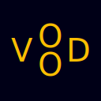
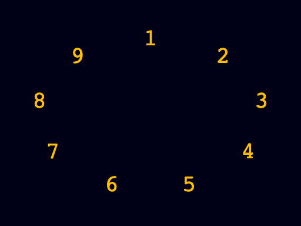
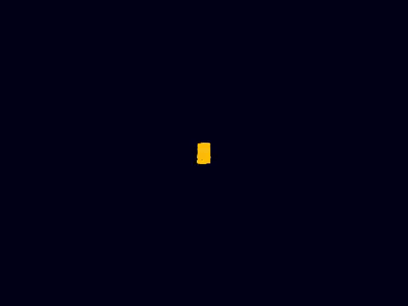

# Vood



Vood is a Python library for programmatically generating SVG graphics and animations. While Vood relies on the excellent [DrawSvg](https://github.com/cduck/drawsvg) for creating the base SVG elements, it features a specialized animation engine built around a clear state and visual element separation. This architecture enables detailed control over transitions, such as property-level easing.

## Installation

### From Source (Development)

Clone the repository and install in editable mode:

```bash
git clone https://github.com/yourusername/vood.git
cd vood
pip install -e .
```

## 🚀 Quick Start

### 🖼️ Static Scene

In this example we arrange the numbers 1 to 9 in an elliptical layout. The core steps to achieve this are:

1. **Create a scene** - The canvas for your composition
2. **Define states** - Define each number's properties (text, font, color)
3. **Apply layout** - Add position information to the states using a layout function
4. **Create renderer** - Create renderer for the states
5. **Create visual elements** - Associate each state with a renderer
6. **Add to scene** - Add all elements to the scene
7. **Export** - Export the scene (options: svg,png,pdf)

```python
# (1) Create scene with square dimensions and defined background color
scene = VScene(width=256, height=192, background="#000017")

# (2) Define text states for each number with consistent styling
states = [
    TextState(
        text=str(num),
        font_family="Courier",
        font_size=20,
        color="#FDBE02",
    )
    for num in range(1, 10)
]

# (3) Arrange numbers in an elliptical layout
states_layout = ellipse_layout(
    states,
    radius_x=96,
    radius_y=64,
)

# (4) Create a text renderer for all numbers
renderer = TextRenderer()

# (5) Create visual elements from states
elements = [
    VElement(
        renderer=renderer,
        state=state,
    )
    for state in states_layout
]

# (6) Add all elements to the scene
scene.add_elements(elements)

# (7) Export to PNG file
exporter = VSceneExporter(
    scene=scene,
    converter=ConverterType.PLAYWRIGHT,
    output_dir="output/",
)

exporter.to_png(filename="01_ellipse_layout.png", width_px=1024)
```

*Complete code*: [01_ellipse_layout.py](./examples/01_ellipse_layout.py)



Why the complexity? While this process might seem over complicated for a static image, the separation of state and visual element is fundamental to Vood's design. The next chapter on animation will show how this architecture allows to easily define complex motion by simply providing multiple states to an visual element.

### 🎬 Animation: State Interpolation

Vood animations are driven by state interpolation (tweening), where every element transitions between defined sets of state.

To animate the scene of our previous example, we'll now define a transition of the numbers from a start state (centered in the scene) to an end state (its position on the previously defined elliptical layout).

The key distinction here is that each `VElement` is now defined as a combination of the `TextRenderer` and a pair of start and end states.

```python
# Create the scene 
scene = VScene(width=256, height=192, background="#000017")

# Create text states for each number with consistent styling
# These states will be the starting point of the animation
start_states = [
    TextState(
        x=0,  # centered horizontally (default but explicit for clarity)
        y=0,  # centered vertically (...)
        text=str(num),
        font_family="Courier",
        font_size=20,
        color="#FDBE02",
    )
    for num in range(1, 10)
]

# Arrange the numbers in an elliptical layout for the end states
end_states = ellipse_layout(
    start_states,
    radius_x=96,
    radius_y=64,
)

# Create a text renderer for all numbers
renderer = TextRenderer()

# Create visual elements from states by
# pairing each start state with its corresponding end state
elements = [
    VElement(
        renderer=renderer,
        states=[start_state, end_state],
    )
    for start_state, end_state in zip(start_states, end_states)
]

# Add all elements to the scene
scene.add_elements(elements)

# Export to PNG file
exporter = VSceneExporter(
    scene=scene,
    converter=ConverterType.PLAYWRIGHT,
    output_dir="output/",
)

exporter.to_mp4(
    filename="number_animation",
    total_frames=60,
    framerate=30,
    width_px=512,
)
```

*Complete code*: [02_simple_animation.py](./examples/02_simple_animation.py)



*(⚠️ Low quality GIF. For the **actual MP4**, click [here](docs/videos/02_simple_animation.mp4).)*

### Advanced Animation Control

While this example uses a simple two-state interpolation, Vood's animation engine supports fine grained timing control:

* **Multi-keyframe sequencing** — Define states with explicit frame_time values for complex choreography.

* **Per-property easing** — Apply different easing functions (ease-in, ease-out, bezier curves) to individual properties for nuanced motion control.

## Documentation

Vood is in active early development with frequent design changes. Instead of maintaining documentation that quickly becomes outdated, we for now offer an evolving Examples Gallery showcasing Vood's core functionality and design patterns.

## Contributing

Contributions are welcome! Please feel free to submit a Pull Request.

## License

This project is licensed under the MIT License - see the [LICENSE](LICENSE) file for details.

## Changelog

### [0.1.0] - 2025-10-26

#### Added

- Initial release
- Core functionality
- Basic examples
