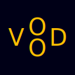
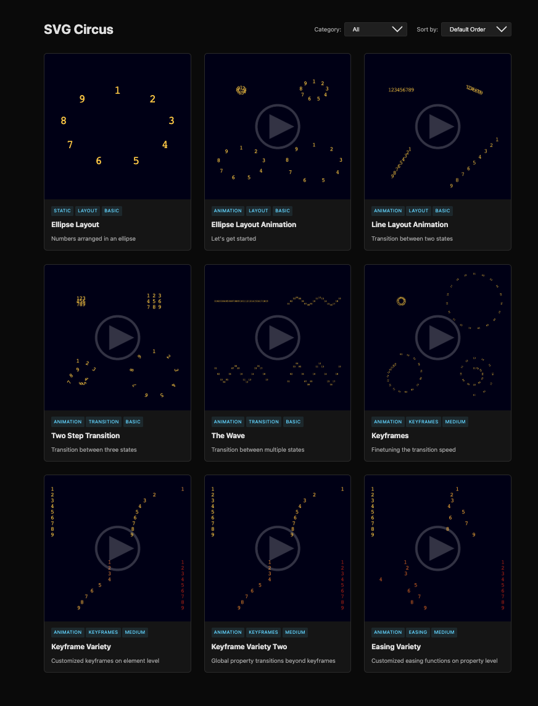

# Vood




Vood is a Python library for programmatically generating SVG graphics and animations. While Vood relies on the excellent [DrawSvg](https://github.com/cduck/drawsvg) for creating the base SVG elements, it features a specialized animation engine built around a clear state and visual element separation. This architecture enables detailed control over transitions, such as property-level easing.

The project is currently in alpha and undergoes frequent breaking changes. You’re very welcome to explore it, but please don’t build anything on top of it yet.

## Installation

### From Source (Development)


Clone the repository and install in editable mode:

```bash
git clone https://github.com/yourusername/vood.git
cd vood
pip install -e .
```

Install the required dependency [DrawSvg](https://github.com/cduck/drawsvg):

```bash
pip install drawsvg
```

### Rasterization

Vood offers multiple ways to convert SVG graphics to PNG and PDF formats. Each has different trade-offs in terms of quality, speed, and setup complexity.

* **ConverterType.CAIROSVG**
  - Install: `pip install cairosvg`
  - Fast rendering but may have font rendering limitations.

* **ConverterType.INKSCAPE**
  - Install: Download from [inkscape.org](https://inkscape.org) and ensure it's in your PATH
  - Moderate speed with good quality, though text-on-path features may have issues.

* **ConverterType.PLAYWRIGHT**
  - Install: `pip install playwright` then `playwright install chromium`
  - Most accurate rendering but slowest performance and largest installation size.

* **ConverterType.PLAYWRIGHT_HTTP** (Recommended for high-quality batch rendering)
  - Install: `pip install vood[playwright-server]` then `playwright install chromium`
  - Highest quality (same as PLAYWRIGHT), runs as background service
  - Start server: `vood playwright-server start`
  - Best for: batch rendering, long-running processes, production workflows
  - See **[PLAYWRIGHT_SERVER.md](docs/PLAYWRIGHT_SERVER.md)** for complete setup guide and features

**Performance Comparison:** See **[benchmark/README.md](benchmark/README.md)** for detailed performance comparisons between all converters. Run `python benchmark/run_benchmark.py` to generate fresh benchmark reports comparing speed, CPU usage, and memory consumption.
  
## 🚀 Quick Start

### 🖼️ Static Scene

In this example we arrange the numbers 1 to 9 in an elliptical layout. The core steps to achieve this are:

1. **Create a scene** - The canvas for your composition
2. **Define states** - Define each number's properties (text, font, color)
3. **Apply layout** - Add position information to the states using a layout function
4. **Create renderer** - Create renderer for the states
5. **Create visual elements** - Associate each state with a renderer
6. **Add to scene** - Add all elements to the scene
7. **Export** - Export the scene (options: svg,png,pdf)

```python
# (1) Create scene with square dimensions and defined background color
scene = VScene(width=256, height=192, background=Color("#000017"))

# (2) Define text states for each number with consistent styling
states = [
    TextState(
        text=str(num),
        font_family="Courier New",
        font_size=20,
        fill_color=Color("#FDBE02"),
    )
    for num in range(1, 10)
]

# (3) Arrange numbers in an elliptical layout
states_layout = layout.ellipse(
    states,
    rx=96,
    ry=64,
)

# (4) Create a text renderer for all numbers
renderer = TextRenderer()

# (5) Create visual elements from states
elements = [
    VElement(
        renderer=renderer,
        state=state,
    )
    for state in states_layout
]

# (6) Add all elements to the scene
scene.add_elements(elements)

# (7) Export to PNG 
exporter = VSceneExporter(
    scene=scene,
    converter=ConverterType.PLAYWRIGHT,
    output_dir="output/",
)

# Export to SVG and PNG
exporter.export(
    filename="01_ellipse_layout", formats=["svg", "png"], png_width_px=1024
)
```

*Complete code*: [01_ellipse_layout.py](./examples/01_ellipse_layout.py)


Why the complexity? While this process might seem over complicated for a static image, the separation of state and visual element is fundamental to Vood's design. The next chapter on animation will show how this architecture allows to easily define complex motion by simply providing multiple states to an visual element.

### 🎬 Animation: State Interpolation

Vood animations are driven by state interpolation (tweening), where every element transitions between defined sets of state.

To animate the scene of our previous example, we'll now define a transition of the numbers from a start state (centered in the scene) to an end state (its position on the previously defined elliptical layout).

The key distinction here is that each `VElement` is now defined as a combination of the `TextRenderer` and a pair of start and end states.

```python
# Create the scene 
scene = VScene(width=256, height=192, background=Color("#000017"))

# Create text states for each number with consistent styling
# These states will be the starting point of the animation
start_states = [
    TextState(
        x=0,  # centered horizontally (default but explicit for clarity)
        y=0,  # centered vertically (...)
        text=str(num),
        font_family="Courier New",
        font_size=20,
        fill_color=Color("#FDBE02"),
    )
    for num in range(1, 10)
]

# Arrange the numbers in an elliptical layout for the end states
end_states = layout.ellipse(
    start_states,
    rx=96,
    ry=64,
)

# Create a text renderer for all numbers
renderer = TextRenderer()

# Create visual elements from states by
# pairing each start state with its corresponding end state
elements = [
    VElement(
        renderer=renderer,
        keystates=states,
    )
    for states in zip(start_states, end_states)
]

# Add all elements to the scene
scene.add_elements(elements)

# Export to MP4 
exporter = VSceneExporter(
    scene=scene,
    converter=ConverterType.PLAYWRIGHT,
    output_dir="output/",
)

exporter.to_mp4(
    filename="number_animation",
    total_frames=60,
    framerate=30,
    png_width_px=1024,
)
```

*Complete code*: [02_simple_animation.py](./examples/02_simple_animation.py)


### Advanced Animation Control

While this example uses a simple two-state interpolation, Vood's animation engine supports fine grained timing control:

* **Multi-keystate sequencing** — Control timing with explicit frame time values for detailed animation sequences. See [SVG Circus - timed keystates](https://vood.wectar.com/circus/timed-keystates/)

* **Per-property easing** — Apply different easing functions (ease-in, ease-out, bezier curves etc) to individual properties for nuanced motion control. See [SVG Circus - Easing Variety](https://vood.wectar.com/circus/easing-variety/)

* **Segment Easing** - Customize easing between keystates. See [SVG Circus - Segment Easing](https://vood.wectar.com/circus/segment-easing/)

* **Property Keystates** - Apply property transitions beyond the main keystates - See [SVG Circus - Property Keystates](https://vood.wectar.com/circus/property-keystates/)

## 📓 Jupyter Notebook Support

Vood provides comprehensive support for Jupyter notebooks with static scene display, interactive animation preview (grid and navigator layouts), and MP4 export. Perfect for fast iteration and testing!

See **[docs/JUPYTER_SUPPORT.md](docs/JUPYTER_SUPPORT.md)** for complete documentation and examples.

## 🔧 Development Server

For rapid animation development outside Jupyter, Vood includes a development server with live browser preview and automatic hot-reload. Edit your Python animation code, save the file, and watch the browser update instantly—no manual refresh needed.

```bash
# Install dev server dependencies
pip install vood[devserver]

# Start server (defaults: 20 frames @ 10 FPS)
vood serve my_animation.py

# Smooth animation (60 frames @ 30 FPS)
vood serve my_animation.py --frames 60 --fps 30
```

The server watches your animation file for changes and automatically reloads the preview in your browser. Syntax and runtime errors are displayed gracefully without crashing the server.

**Export directly from the browser:**
- **MP4**: Professional video export with ffmpeg
- **GIF**: Lightweight animated format for web sharing
- **HTML**: Self-contained interactive file for website embedding

Just click the export button, configure settings, and download when ready - all while the server keeps running.

See **[DEVSERVER.md](docs/DEVSERVER.md)** for complete documentation, CLI options, and advanced features.

## ⚙️ Configuration

Vood supports TOML-based configuration for customizing default values. Create a `vood.toml` file in your project directory to set scene dimensions, colors, logging levels, and more. For a complete documentation, see **[CONFIG.md](docs/CONFIG.md)**.

## SVG Circus

Rather than writing full-fledged documentation for Vood at this early stage of development, we’re focusing on building an evolving collection of examples. SVG Circus is meant to highlight Vood’s capabilities and to give users a hands-on way to explore what it can do — complete with the Python source code used to generate and animate each SVG.
See [https://vood.wectar.com/](https://vood.wectar.com/).

<a href="https://vood.wectar.com/">

</a>

## Contribution

Vood is still in an early stage and has so far been developed primarily to support the needs of a specific project. That said, it was always intended to evolve into a general-purpose library. We deeply appreciate your feedback and would love to hear your ideas for improving Vood — be it bug reports, feature requests, pull requests, or anything else you’d like to share.

## Changelog

See [CHANGELOG.md](docs/CHANGELOG.md) for version history.

## License

This project is licensed under the MIT License - see the [LICENSE](LICENSE) file for details.
